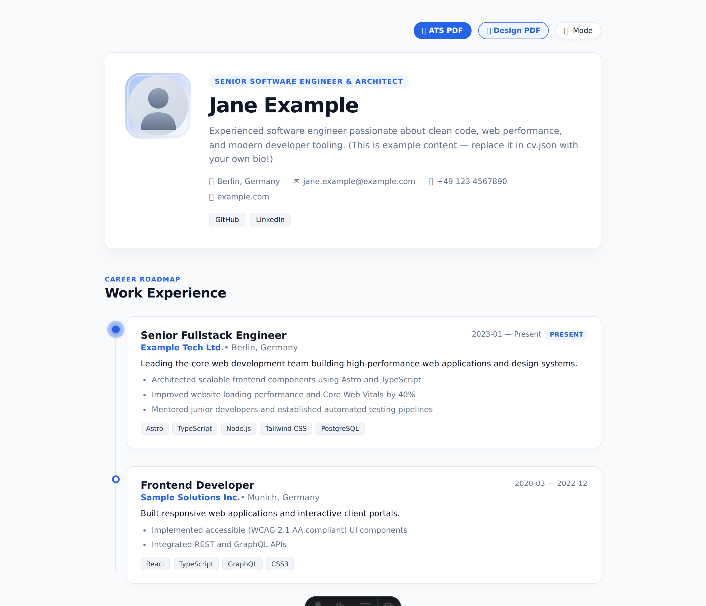
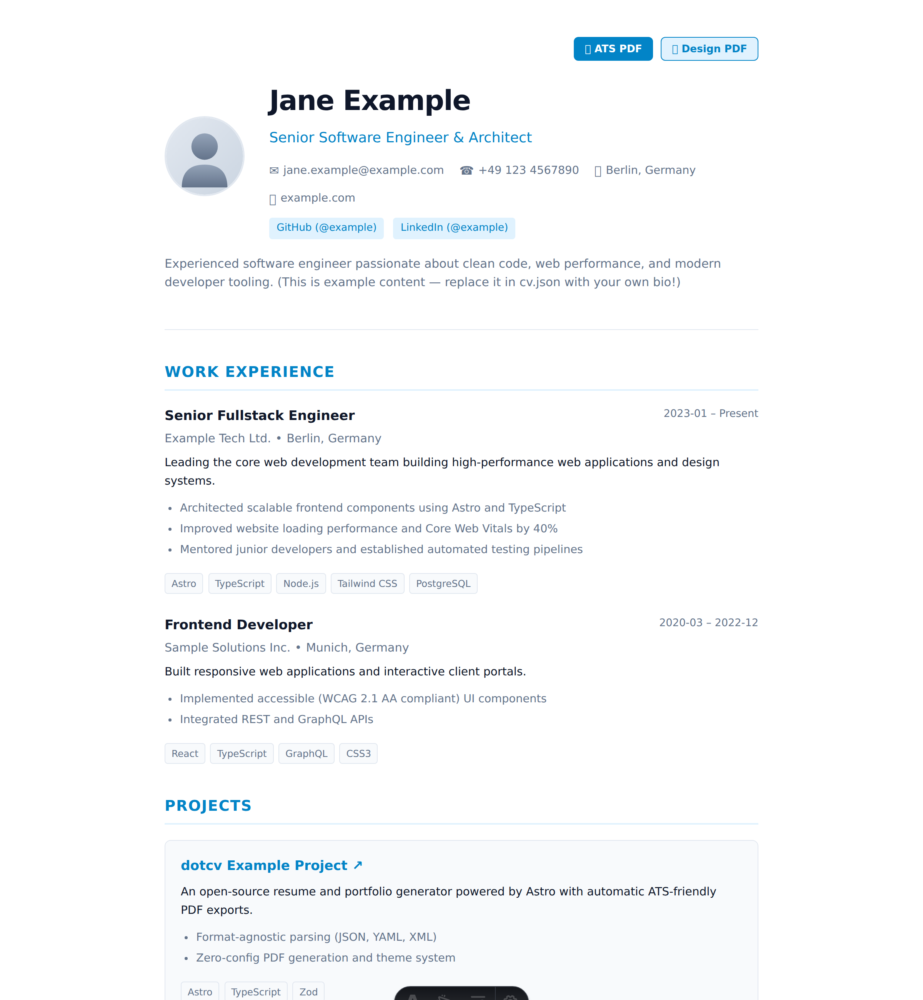
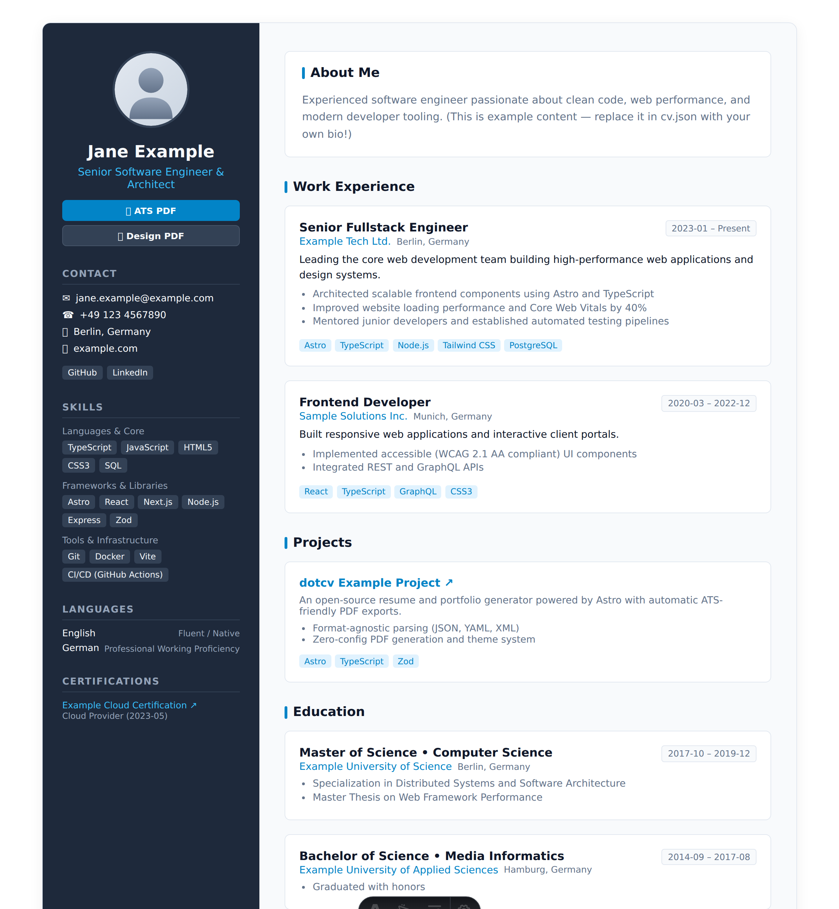
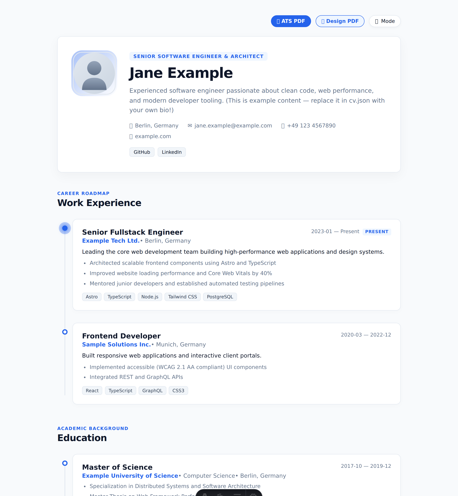
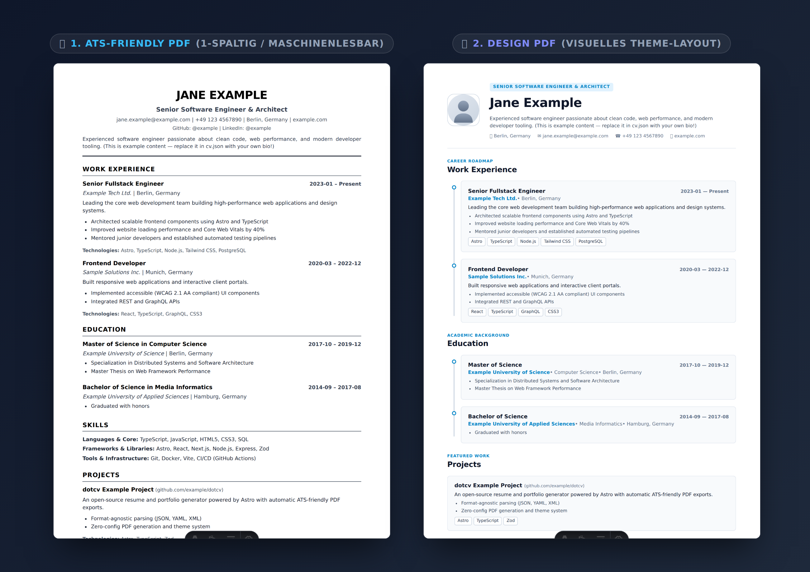

# dotcv

> A modern, minimalist, and ATS-friendly CV and portfolio platform inspired by *readcv*, built with [Astro](https://astro.build).

[**Live Demo ↗**](https://tjaugust01.github.io/dotcv/) · [Features](#features) · [Themes](#available-themes) · [Quick Start](#quick-start) · [Documentation](#configuration-reference)

Manage your resume data and preferences in simple root configuration files and get an elegant online presence alongside a machine-readable, printable PDF resume.

[](https://tjaugust01.github.io/dotcv/)

---

## Features

- **Root-Level Configuration:** Maintain your resume data (`cv.json`) and settings (`dotcv.config.json`) directly in the project root.
- **Dual PDF Export:**
  - **ATS Resume:** A standardized, single-column vector layout optimized for Applicant Tracking Systems (Workday, Greenhouse, etc.) with precise print pagination.
  - **Design PDF:** A styled PDF matching the visual layout of your chosen web theme for personal presentations.
- **Pluggable Theme System:** Switch between pre-built themes (`classic`, `sidebar`, `timeline`) or create custom layouts.
- **Internationalization (i18n):** Built-in multi-language support (e.g., English, German).
- **SEO & Social Sharing:**
  - OpenGraph and Twitter Card metadata for rich previews on LinkedIn, X, and other platforms.
  - Structured data with Schema.org (`Person`) JSON-LD.
  - Dynamic keyword and canonical URL generation.
- **Static & Fast:** 100% Static Site Generation (SSG) with zero runtime dependencies. Deployable on GitHub Pages, Cloudflare Pages, Vercel, Netlify, or any static web server.

---

## Available Themes

`dotcv` includes three themes out of the box. You can configure the active theme in `dotcv.config.json` or preview each theme live via the links below:

### 1. Classic Theme (`classic`)
An elegant, centered single-column layout with clean typography and subtle accents. Suitable for any industry.

[**View Classic Demo ↗**](https://tjaugust01.github.io/dotcv/) *(Local: `http://localhost:4321/preview/classic`)*



---

### 2. Sidebar Theme (`sidebar`)
A modern two-column layout featuring a sticky profile sidebar on the left and chronological career milestones on the right.

[**View Sidebar Demo ↗**](https://tjaugust01.github.io/dotcv/preview/sidebar) *(Local: `http://localhost:4321/preview/sidebar`)*



---

### 3. Timeline Theme (`timeline`)
A timeline layout designed for engineers and creatives, complete with a dark mode toggle, hero profile header, and tagged cards.

[**View Timeline Demo ↗**](https://tjaugust01.github.io/dotcv/preview/timeline) *(Local: `http://localhost:4321/preview/timeline`)*



---

## Dual PDF Export

`dotcv` provides two distinct PDF formats:



1. **ATS Resume (`/print/ats`):** 
   - Strict single-column layout, standard typography, and clean text flow.
   - Ensures optimal parsing rates across automated HR and recruiting software.
2. **Design PDF (`/print/design`):** 
   - Visually styled to match your chosen web theme.
   - Ideal for direct recruiter contact, interviews, or portfolio presentations.

---

## Quick Start

### 1. Clone the repository & install dependencies

```bash
git clone https://github.com/your-username/dotcv.git
cd dotcv
npm install
```

### 2. Add your CV data

Create your personal `cv.json` (or use `cv.example.json` as a starting point):

```bash
cp cv.example.json cv.json
```

### 3. Start the local development server

```bash
npm run dev
```

Open [http://localhost:4321](http://localhost:4321) in your browser.

---

## Configuration Reference

### 1. `dotcv.config.json` (Settings)

This file controls the theme, localization, and PDF export behaviors:

```json
{
  "theme": "classic",
  "locale": "en",
  "pdf": {
    "theme": "classic",
    "format": "a4",
    "showAtsButton": true,
    "showDesignButton": true,
    "filename": "CV_{name}.pdf"
  }
}
```

#### Available Options

| Option | Type | Default | Description |
| :--- | :--- | :--- | :--- |
| **`theme`** | `string` | `"classic"` | Active web theme (`classic`, `sidebar`, `timeline`). |
| **`locale`** | `string` | `"en"` | Language code for UI strings and date formatting (`en`, `de`). |
| **`pdf.theme`** | `string` *(optional)* | `theme` | Theme override for the Design PDF export (e.g., use `classic` for PDF while keeping `timeline` on web). |
| **`pdf.format`** | `"a4" \| "letter"` *(optional)* | `"a4"` | Page size for print and PDF generation (`"a4"` or `"letter"`). |
| **`pdf.showAtsButton`** | `boolean` *(optional)* | `true` | Toggles the visibility of the ATS PDF download button on the website. |
| **`pdf.showDesignButton`** | `boolean` *(optional)* | `true` | Toggles the visibility of the Design PDF download button on the website. |
| **`pdf.filename`** | `string` *(optional)* | `"{name} — CV"` | Default filename suggested in browser save dialogs. Supports `{name}` and `{title}` placeholders. |

---

### 2. `cv.json` (Resume Data)

The `cv.json` file contains all structured profile information:

```json
{
  "profile": {
    "name": "Jane Example",
    "title": "Senior Software Engineer & Architect",
    "email": "jane@example.com",
    "phone": "+1 234 567 8900",
    "location": "San Francisco, CA",
    "website": "https://example.com",
    "avatar": "/avatar.svg",
    "bio": "Brief overview about your professional background and core strengths.",
    "socials": [
      {
        "plattform": "GitHub",
        "url": "https://github.com/example",
        "username": "example"
      }
    ]
  },
  "experience": [
    {
      "company": "Tech Company",
      "role": "Senior Engineer",
      "location": "San Francisco, CA",
      "startDate": "2022-01",
      "endDate": null,
      "current": true,
      "description": "Core responsibilities and team leadership.",
      "highlights": [
        "Architected scalable frontend components using Astro and TypeScript",
        "Improved website loading performance and Core Web Vitals by 40%"
      ],
      "technologies": ["TypeScript", "Astro", "React", "Node.js"]
    }
  ],
  "education": [
    {
      "institution": "University of Technology",
      "degree": "Master of Science",
      "fieldOfStudy": "Computer Science",
      "startDate": "2018-10",
      "endDate": "2020-09",
      "location": "San Francisco, CA",
      "highlights": ["Focus on distributed systems and web performance"]
    }
  ],
  "skills": [
    {
      "category": "Frontend",
      "skills": ["Astro", "TypeScript", "React", "Tailwind CSS"]
    }
  ],
  "projects": [
    {
      "title": "Open Source Project",
      "description": "Project overview and key features.",
      "url": "https://github.com/example/project",
      "technologies": ["Astro", "TypeScript"]
    }
  ],
  "certifications": [
    {
      "title": "Cloud Architect Certificate",
      "issuer": "Cloud Provider",
      "date": "2023-05",
      "url": "https://example.com/cert"
    }
  ],
  "languages": [
    {
      "language": "English",
      "fluency": "Native"
    },
    {
      "language": "German",
      "fluency": "Professional working proficiency"
    }
  ]
}
```

---

## Project Structure

```
dotcv/
├── cv.json                   # Personal CV data (or cv.yaml / cv.xml)
├── cv.example.json           # Template with placeholder data
├── dotcv.config.json         # Settings (Theme, locale, PDF options)
├── public/                   # Static assets (Avatar, Favicon, Fonts)
├── src/
│   ├── components/
│   │   └── pdf/
│   │       └── AtsResume.astro  # Standardized ATS-optimized PDF layout
│   ├── lib/
│   │   ├── configSchema.ts   # Zod validation schema for config
│   │   ├── cvSchema.ts       # Zod validation schema for CV data
│   │   ├── i18n/             # Translations (en, de, ...)
│   │   └── parser/           # Format-agnostic loaders & parsers
│   ├── pages/
│   │   ├── index.astro       # Public CV website
│   │   ├── preview/
│   │   │   └── [theme].astro # Live preview routes for each theme (/preview/<theme>)
│   │   ├── print/
│   │   │   ├── ats.astro     # Route for ATS PDF (/print/ats)
│   │   │   └── design.astro  # Route for Design PDF (/print/design)
│   │   └── print.astro       # Default print fallback route
│   └── themes/
│       ├── classic/          # Classic Theme (index.astro & pdf.astro)
│       ├── sidebar/          # Sidebar Theme (index.astro & pdf.astro)
│       ├── timeline/         # Timeline Theme (index.astro & pdf.astro)
│       └── registry.ts       # Theme registry
├── astro.config.mjs
└── package.json
```

---

## Deployment

Since `dotcv` generates static HTML, CSS, and JS, it can be hosted on any static hosting provider or web server:

### 1. Configure site URL (`astro.config.mjs`)
```js
import { defineConfig } from 'astro/config';

export default defineConfig({
  site: 'https://your-domain.com',
});
```

### 2. Choose your hosting provider
- **Vercel / Netlify / Cloudflare Pages:**
  - Build Command: `npm run build`
  - Output Directory: `dist`
- **GitHub Pages:**
  - Deploy using the standard [Astro GitHub Pages Action](https://docs.astro.build/en/guides/deploy/github/).
- **Self-hosted (Nginx / Caddy / Docker):**
  - Serve the generated static files from the `dist/` directory.

---

## Available Scripts

| Command | Action |
| :--- | :--- |
| `npm run dev` | Starts the Astro development server with hot module reloading |
| `npm run build` | Builds the production-ready static website to the `dist/` folder |
| `npm run preview` | Starts a local preview server for the built `dist/` directory |
| `npm run screenshots` | Automatically captures all theme previews and PDF comparison graphics in `docs/images/` |

---

## License

MIT License – Free for personal and commercial use.
